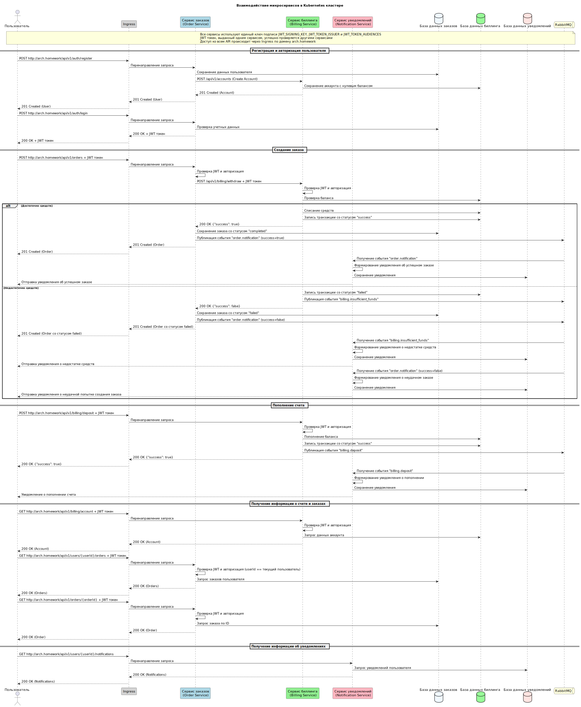

# Shop Helm Chart

Данный Helm чарт развертывает микросервисную архитектуру интернет-магазина, состоящую из трех сервисов:
- Order Service (Сервис заказов) - 2 реплики
- Billing Service (Сервис биллинга) - 2 реплики
- Notification Service (Сервис уведомлений) - 2 реплики

Также чарт включает необходимую инфраструктуру:
- PostgreSQL (для хранения данных)
- RabbitMQ (для асинхронного обмена сообщениями)
- Mailhog (для эмуляции SMTP сервера и просмотра отправленных email)

## Требования

- Kubernetes 1.19+
- Helm 3.2.0+
- Настроенный Ingress Controller (NGINX)
- Доступ к реестру Docker образов, содержащему образы сервисов

## Установка

1. Клонируйте репозиторий с чартом:
```bash
git clone https://github.com/director74/dz7_shop_chart
cd dz7_shop_chart
```

2. Установите чарт:
```bash
helm install shop ./
```

Примечание: Namespace "dz7" будет создан автоматически при установке чарта. Если вы хотите использовать другой namespace, укажите его в параметре values.yaml (global.namespace) и в команде установки.

## Настройка

Конфигурация чарта осуществляется через файл `values.yaml`. Основные параметры:

- `global.namespace` - Namespace для установки всех ресурсов
- `global.ingress` - Настройки Ingress
- `global.jwt` - Настройки JWT для авторизации между сервисами
- `global.postgresql` - Общие настройки PostgreSQL
- `global.rabbitmq` - Общие настройки RabbitMQ

Каждый сервис имеет свои параметры конфигурации:
- `order`, `billing`, `notification` - Настройки соответствующих сервисов
- `postgres`, `rabbitmq`, `mailhog` - Настройки инфраструктуры

## Доступ к сервисам

### API Endpoints

- Order Service API: http://arch.homework/api/v1/orders, http://arch.homework/api/v1/auth, ...
- Billing Service API: http://arch.homework/api/v1/billing, http://arch.homework/api/v1/accounts, ...
- Notification Service API: http://arch.homework/api/v1/notifications, ...

### Интерфейсы управления

- RabbitMQ Management UI: http://arch.homework/rabbitmq/
  - Логин/пароль: значения из `global.rabbitmq.auth.username`/`global.rabbitmq.auth.password` (по умолчанию: guest/guest)

- Mailhog UI (просмотр отправленных писем): http://arch.homework/mailhog/
  - Не требует аутентификации

## Миграции баз данных

Миграции баз данных выполняются автоматически при установке или обновлении чарта через Kubernetes Jobs.

## Тестирование

Для тестирования API предоставляется Postman коллекция:
- Коллекция для Kubernetes: `/tests/postman_collection.json` (использует hostname arch.homework)

### Запуск автотестов с помощью Newman

```bash
newman run "postman_collection.json" -e k8s-environment.json
```

Параметры Newman, используемые в скрипте:
- `--timeout-request 60000` - увеличивает таймаут запроса до 60 секунд
- `--delay-request 1000` - добавляет задержку 1 секунду между запросами

Тесты проверяют следующие сценарии:
- Регистрация и авторизация пользователя
- Создание аккаунта в биллинге
- Пополнение баланса
- Создание успешного заказа
- Проверка списания средств
- Создание неудачного заказа (недостаточно средств)
- Проверка отправки уведомлений

## Документация

### API Спецификация (Swagger)

Полную спецификацию API можно найти в файле [swagger.yaml](docs/swagger.yaml).

## Визуальные материалы

### Диаграмма последовательности взаимодействия

 